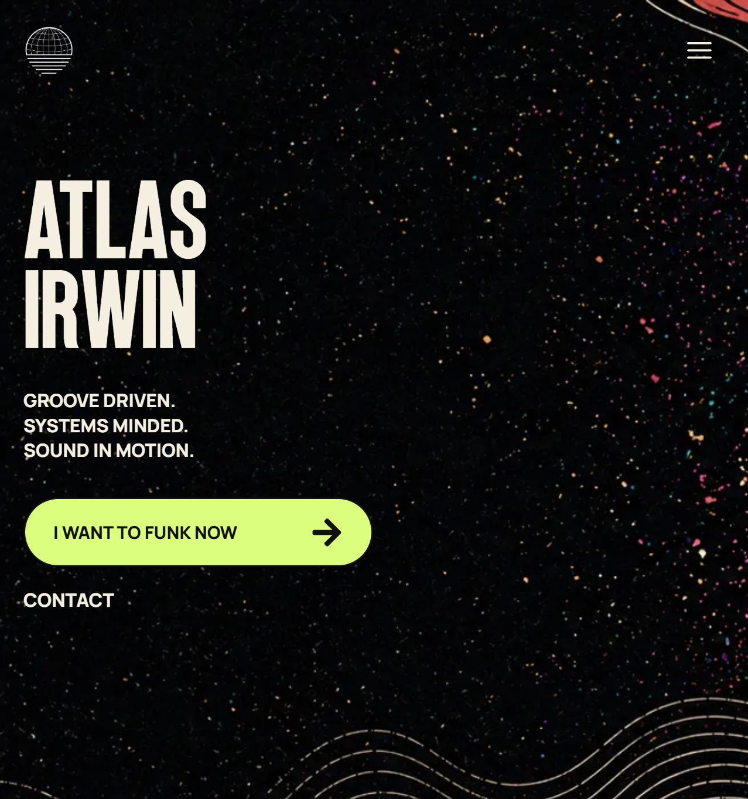
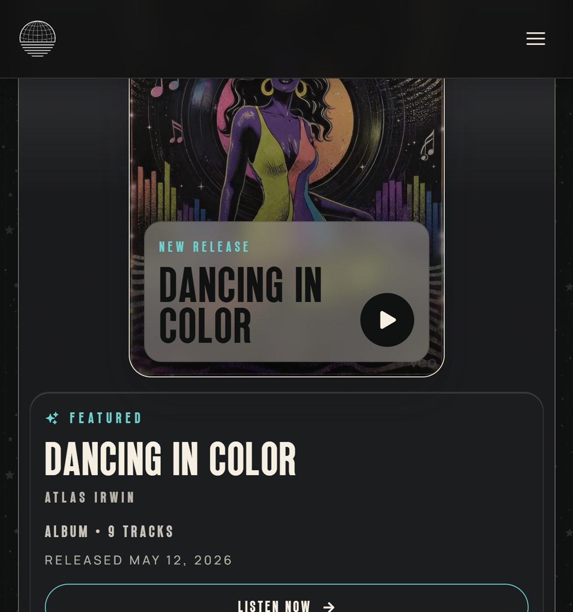
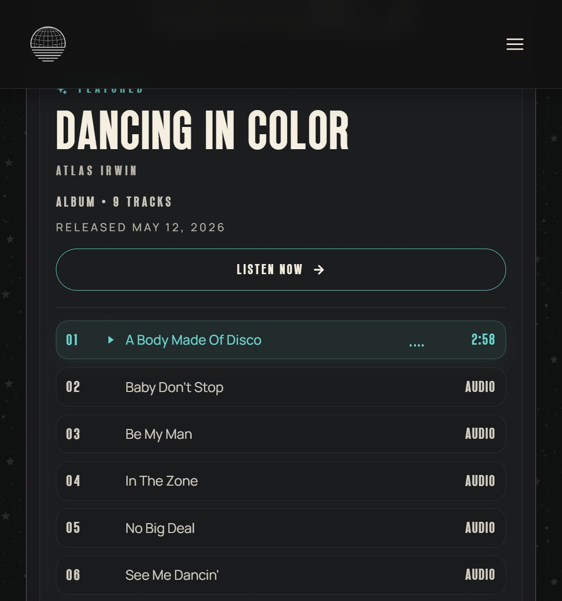
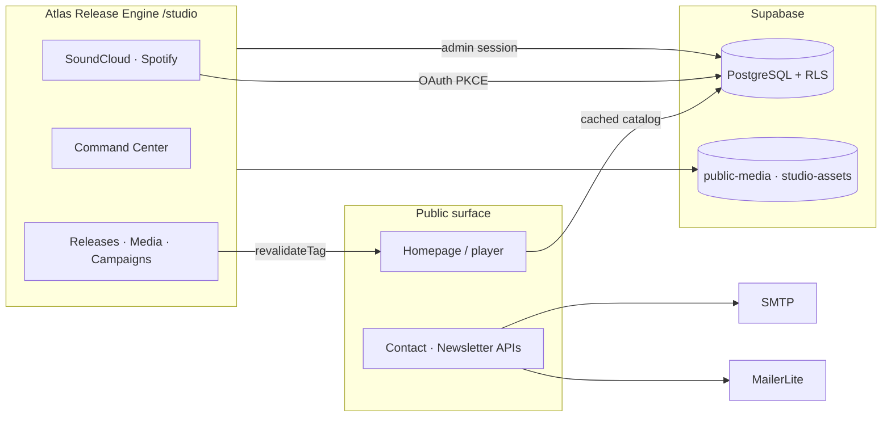

<div align="center">

# Atlas Irwin

**Artist website + private release-operations studio — live in production.**

[](https://atlasirwin.com)
[](https://github.com/yotamon/Atlas-Irwin/actions)
[](https://nextjs.org/)
[](https://www.typescriptlang.org/)
[](LICENSE)

[Live site](https://atlasirwin.com) · [Architecture](docs/catalog-architecture.md) · [Security](SECURITY.md)

</div>

---

<p align="center">
  
</p>

A full-stack product for an independent music project: a public, conversion-minded artist site on one side, and **Atlas Release Engine** — a private Studio for catalog publishing, media, campaigns, analytics, and platform sync — on the other.

Built as a real production system, not a brochure page.

## Why this project exists

Most artist sites are static marketing shells. This one treats releases as an **operating system**:

- Publish catalog changes to the homepage **without redeploying**
- Plan campaigns, content, and outreach around each release
- Sync SoundCloud and Spotify with OAuth 2.1 + PKCE, then reconcile unmatched tracks intentionally
- Keep private Studio assets, tokens, and admin routes isolated from the public surface

## Highlights

| Area | What shipped |
| --- | --- |
| **Public site** | Brand-led homepage, multi-release player (local audio + SoundCloud), platforms, about, SMTP contact, MailerLite newsletter, light/dark theme |
| **Live catalog** | Supabase is the source of truth; Studio mutations call `revalidateTag("public-catalog")` so listeners see updates immediately |
| **Release Engine** | Command Center, per-release workspace, campaigns, media library (SHA-256 dedupe), data-health audits, weighted analytics, brand guardrails |
| **Integrations** | SoundCloud + Spotify OAuth with PKCE, private token storage, sync staging tables, reconciliation queue, explicit campaign playlists |
| **Security** | Supabase RLS, studio route guards, CSP/HSTS headers, honeypot + rate-limited APIs, Studio `noindex` / `no-store` |
| **Engineering** | Strict TypeScript, Zod-validated server actions, typed DB schema, GitHub Actions CI (typecheck · lint · build) |

<p align="center">
  
  &nbsp;
  
</p>

## Architecture at a glance



| Layer | Stack |
| --- | --- |
| App | Next.js 16 (App Router) · React 19 · TypeScript · Tailwind CSS 4 · Framer Motion |
| Data | Supabase (Auth, Postgres, Storage) · Zod · tagged cache revalidation |
| Ops | Vercel · GitHub Actions · SMTP · MailerLite · SoundCloud / Spotify APIs |

## Atlas Release Engine (Studio)

Private product surface at `/studio` — password auth, admin allowlist, and localhost bypass for development.

| Surface | Job |
| --- | --- |
| **Command Center** | Active release, attention queue, homepage preview, 7-day runway, metrics pulse |
| **Releases** | Full workspace per release: Overview · Music · Media · Website · Campaign · Performance |
| **Campaigns** | Content + outreach workload in list or calendar form |
| **Media Library** | Global assets, signed uploads, SHA-256 dedupe, attach-to-release |
| **Data Health** | Reconciliation, metadata, media, placement, and stale-sync audits |
| **Analytics** | Manual metric snapshots + weighted content performance scoring |
| **Connections** | SoundCloud / Spotify hubs — sync, reconcile, never silently invent catalog rows |

Deep dive: [`docs/catalog-architecture.md`](docs/catalog-architecture.md)

## Quick start

```bash
npm install
cp .env.example .env.local   # fill in values
npm run dev
```

Open [http://localhost:3000](http://localhost:3000). Studio at `/studio` bypasses login on localhost when `NODE_ENV` is not production.

| Command | Purpose |
| --- | --- |
| `npm run dev` | Local development |
| `npm run build` | Production build |
| `npm run start` | Serve production build |
| `npm run lint` | ESLint |
| `npm run typecheck` | TypeScript check |
| `npm run env:restore` | Merge non-secret vars from Vercel into `.env.local` |
| `npm run studio:import` | Import legacy `public/releases/` manifests into Supabase |

## Project layout

```
app/              Public pages, API routes, and Studio (protected)
components/       Shared UI and Studio components
lib/              Auth, catalog, Supabase clients, integrations
public/           Static assets, fonts, legacy release manifests (import only)
supabase/         Database migrations + RLS
scripts/          Import, seed, and maintenance tooling
docs/             Architecture docs and README screenshots
```

## Environment

Copy `.env.example` to `.env.local`, or pull what Vercel allows locally:

```bash
npm run env:restore
```

Vercel CLI only exports non-sensitive values. **Secrets** (`STUDIO_PASSWORD`, `SUPABASE_SERVICE_ROLE_KEY`, SMTP, SoundCloud, Spotify, MailerLite, etc.) must be copied from Vercel → Settings → Environment Variables.

Required variables (see `.env.example` for the full list):

```env
NEXT_PUBLIC_SUPABASE_URL=
NEXT_PUBLIC_SUPABASE_ANON_KEY=
SUPABASE_SERVICE_ROLE_KEY=
STUDIO_ADMIN_EMAILS=artist@example.com
STUDIO_PASSWORD=your-studio-password
NEXT_PUBLIC_SITE_URL=https://atlasirwin.com
```

Only the Supabase URL and publishable/anon key are browser-visible. The service-role key stays server-only.

### Supabase setup

1. Create a Supabase project and apply migrations in `supabase/migrations/` (`npx supabase db push`).
2. Auth → URL Configuration: set the site URL and add `/studio/auth/callback` redirects for local + production.
3. Sign in at `/studio/login`, then approve the profile:

```sql
update public.profiles
set is_admin = true
where email = 'artist@example.com';
```

The email must also appear in `STUDIO_ADMIN_EMAILS`. Tables and the private `studio-assets` bucket use RLS.

### Platform OAuth

- **SoundCloud** — OAuth 2.1 + PKCE; sync updates staging tables; unmatched tracks go to a reconciliation queue.
- **Spotify** — authorization code + PKCE; local callbacks must use `127.0.0.1` (not `localhost`). Catalog sync, listener pulse, and campaign playlists are explicit Studio actions.

### Studio workflow (short)

1. Create a release → fill story fields → generate release identity.
2. Generate a content pack (drafts only — nothing auto-posts).
3. Schedule in Content Lab / Calendar; log outreach copy without sending.
4. Publish + enable homepage placement → public catalog revalidates.
5. Resolve mismatches in Data Health / Connections.

Legacy folders under `public/releases/` are **import input only** — the homepage reads Supabase at runtime.

```bash
npm run studio:import
```

## Public homepage catalog

`getPublicReleases()` powers the player. Publish in Studio, enable homepage placement, and the site updates through cache revalidation — no redeploy. Set `NEXT_PUBLIC_SITE_URL` to the production HTTPS origin.

## Security

Production enforces HTTPS redirect plus HSTS, CSP, clickjacking, content-sniffing, referrer, and permissions headers. Studio responses are `private, no-store`, carry `X-Robots-Tag: noindex`, and are excluded by `robots.txt`. Private assets use signed/authenticated Storage access.

See [`SECURITY.md`](SECURITY.md) for vulnerability reporting.

## Contact & newsletter

- **Contact** — SMTP (`CONTACT_SMTP_*`, `CONTACT_EMAIL_FROM`, `CONTACT_EMAIL_TO`). Gmail needs an app password.
- **Newsletter** — MailerLite (`MAILERLITE_API_KEY`, optional `MAILERLITE_GROUP_IDS`). Both routes use rate limiting and honeypot fields.

## Windows note

If `next build` fails on missing native CSS binaries (`lightningcss` / `tailwindcss-oxide`), run `npm run postinstall` to fetch the correct bindings for your CPU target.

## License

Application source is MIT — see [`LICENSE`](LICENSE). Fonts under `public/fonts/` keep their own licenses.
